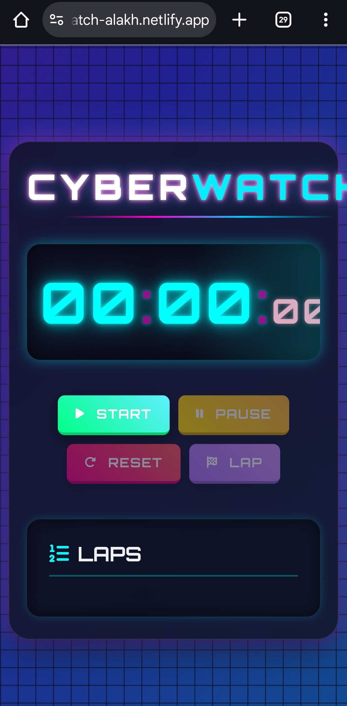

# ⏱️ Modern Stopwatch Webpage

A modern and responsive stopwatch web application built using HTML, CSS, and JavaScript.  
This project allows users to start, pause, and reset time with a clean and minimal user interface.

## 🚀 Live Demo
🔗 
https://alakhhawk47.github.io/Modern-stopwatch-webpage/

## 📌 Features
- Start stopwatch
- Pause functionality
- Reset timer
- Accurate time tracking
- Modern UI design
- Fully responsive layout
- Beginner-friendly JavaScript project

## 🛠️ Tech Stack
- HTML5
- CSS3
- JavaScript
- Netlify (Deployment)

## 📂 Project Structure

## 💻 How to Run Locally
1. Clone the repository
2. Open project folder
3. Open `index.html` in browser
4. Use stopwatch

## 🌱 Learning Purpose
This project was created to practice JavaScript concepts like DOM manipulation, event handling, and time functions while building a modern UI stopwatch.

## 👨‍💻 Author
Alakh Raj Singh
B.Tech EC – JSS Academy of Technical Education, Noida

## GitHub: 
🔗 https://github.com/alakhhawk47

